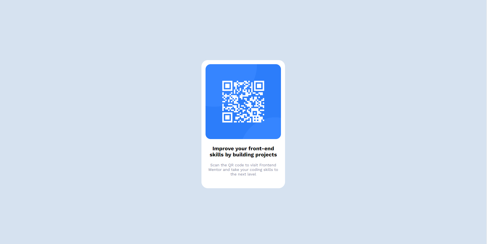

# Frontend Mentor - QR code component solution

This is a solution to the [QR code component challenge on Frontend Mentor](https://www.frontendmentor.io/challenges/qr-code-component-iux_sIO_H). Frontend Mentor challenges help you improve your coding skills by building realistic projects.

## Table of contents

- [Overview](#overview)
  - [Screenshot](#screenshot)
  - [Links](#links)
- [My process](#my-process)
  - [Built with](#built-with)
  - [What I learned](#what-i-learned)
  - [Continued development](#continued-development)
- [Author](#author)

## Overview

### Screenshot



### Links

- Solution URL: [Github Repository](https://github.com/Alaaa1/qr-code-component-main)
- Live Site URL: [Github Pages](https://alaaa1.github.io/qr-code-component-main/)

## My process

### Built with

- Semantic HTML5 markup
- CSS custom properties
- Flexbox

### What I learned

I learned how I can easily center my elements using CSS Flexbox:

```css
body {
  display: flex;
  justify-content: center;
  align-items: center;
  min-height: 100vh;
}
```

### Continued development

I need to continue practicing my CSS especially when it comes down to using Flexbox and Gridbox

## Author

- Website - [Alaa](https://www.your-site.com)
- Frontend Mentor - [@Alaaa1](https://www.frontendmentor.io/profile/Alaaa1)
